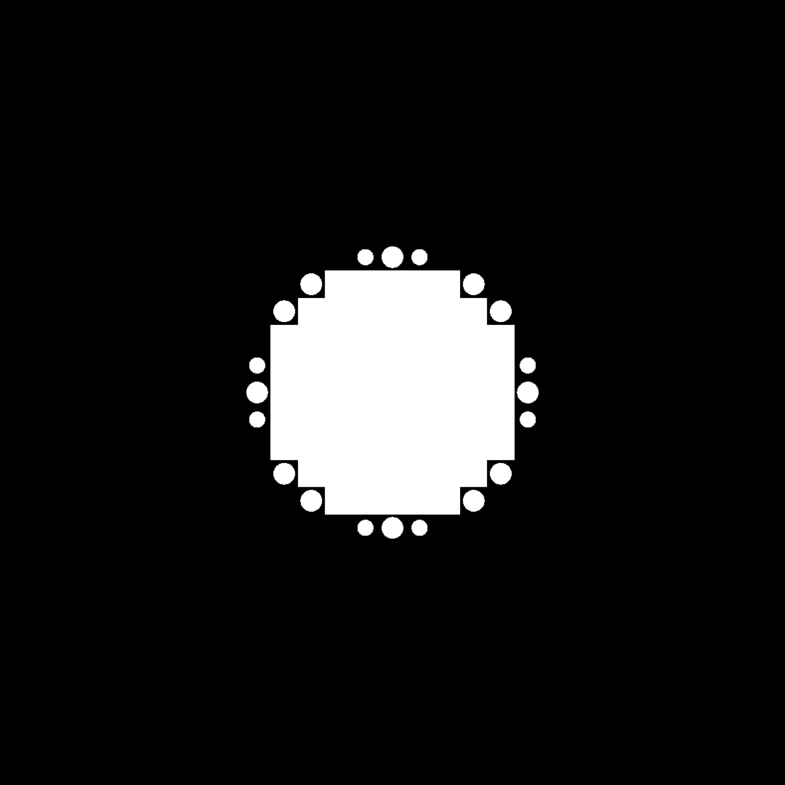
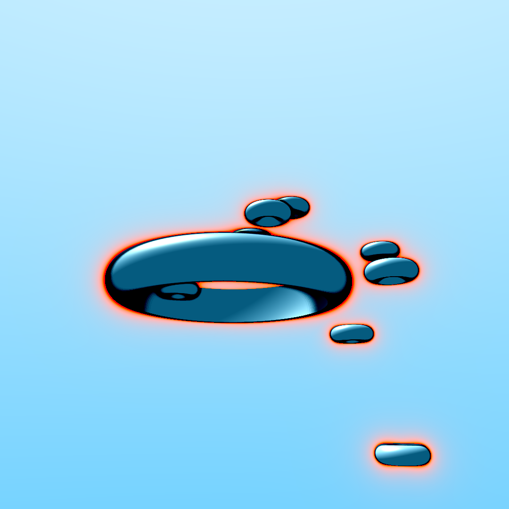

# Live Coding

Code and images from my live coding sessions with [Enguerrand de Smet](https://github.com/dsmtE/).

## Hologram UI

The idea was to stack planes that have interesting patterns on them to create some mysterious hologram effect

## Truchet Tiling

A simple demo of what can be done with Truchet tiling

## RayMarching demo

A simple demo of what can be done with ray marching

## Planet

A procedural planet rendered with ray marching and a few other techniques. We put an emphasis on water rendering with reflections, refractions, scattering *etc*.

.png)
